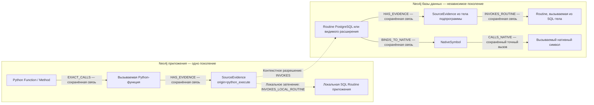

# Обзор модели CodeKG

CodeKG — статическая модель исходного кода, привязанная к конкретному поколению графа, со слоем федерации, работающим во время запроса. Она связывает факты из разных языков, если экстракторы могут выделить конкретный вызов или ссылку, а выбранный контекст позволяет разрешить её цель. Это **не** универсальный многоязычный граф вызовов времени исполнения.

## Два независимо обслуживаемых графа

В текущем демонстрационном окружении используются два независимо экспортируемых и обслуживаемых графа Neo4j Community — по одному каждого вида:

- **Граф приложения** — исходный код приложения и его репозиториев, включая Python-сущности `Function`/`Method`, места вызовов и факты из SQL-кода.
- **Граф базы данных** — снимок исходного кода PostgreSQL и только явно выбранные снимки расширений с их зависимостями; содержит объявления SQL-подпрограмм `Routine` и факты о C-символах `NativeSymbol`.

Реестр может одновременно содержать несколько графов базы данных для разных версий, а также несколько графов приложений. Каждый граф имеет собственное поколение корпуса, экземпляр Neo4j, том данных, адрес подключения и маркер `CodeKGGeneration`. Объект `GraphContext` выбирает одну пару «приложение — база данных» и задаёт базу данных приложения, алиасы видимых снимков расширений и SQL-параметр `search_path`. Это правила выбора во время запроса, а не связи между всеми узлами графов. Сохраняемых рёбер Neo4j между разными базами графов нет. Результаты федерации указывают поколения обоих графов и идентификатор контекста; отдельного поля ревизии контекста нет, но ответы разрешения/трассировки и курсоры обратного поиска содержат `context_fingerprint`, вычисленный по эффективной конфигурации контекста. Процесс фиксирует реестр и перед выполнением федеративных запросов проверяет маркер графа и поколения в каждом хранилище. См. [операции с независимыми графами](independent-graph-operations.md) и [проверенное демонстрационное окружение федерации](federated-kg-demo.md).

## Переходы между языками собираются из свидетельств исходного кода

Типичный путь выглядит так:

1. Исходный Python-код содержит статически распознанный вызов функции, представленный ребром `EXACT_CALLS` в графе приложения.
2. Аргумент Python DB-API-вызова `execute`, доступный статически как SQL-литерал или константа, создаёт отдельный факт `SourceEvidence` с происхождением `python_execute`. Статически выделенные вызовы в SQL-файлах имеют происхождение `sql_source`. Ожидаемый вид цели (`routine_kind`: функция или процедура) сохраняется из AST; `CALL` не разрешается к функции. Для Python дополнительно сохраняется `receiver_status`: неподтверждённый получатель `.execute()` не создаёт точного межъязыкового перехода.
3. Выбранный контекст разрешает SQL-имя: сначала проверяется локальная подпрограмма приложения, затем — PostgreSQL и видимые в контексте расширения, с учётом схем и порядка поиска. Эта привязка виртуальная и вычисляется во время запроса.
4. Если целью является SQL-подпрограмма или анализируемая подпрограмма PL/pgSQL, извлечённые ссылки из её тела могут вести к другой `Routine` в графе базы данных. Для подпрограммы на C связь `BINDS_TO_NATIVE` может соединить `Routine` с соответствующим C-символом `NativeSymbol`; далее статический нативный вызов может продолжить путь по `CALLS_NATIVE`.

Таким образом, переход через границу «приложение — база данных» — это *составной результат запроса*, а не сохранённое ребро. Пунктирные стрелки ниже обозначают сборку пути во время запроса, сплошные — сохранённые связи. Сам факт `SourceEvidence` хранится в своём графе, но его контекстная привязка не сохраняется.

Пунктирные стрелки существуют только как сегменты результата. `INVOKES` обозначает вычисленную во время запроса привязку свидетельства SQL-вызова к подпрограмме в графе базы данных. `INVOKES_LOCAL_ROUTINE` обозначает аналогичную привязку к локальной подпрограмме приложения. Ни то ни другое не является связью Neo4j. Сохранённые рёбра `INVOKES_ROUTINE` устроены иначе: они исходят из `SourceEvidence` внутри своего корпуса/графа, включая локальный SQL приложения, а не пересекают границы баз графов; они представляют извлечённые свидетельства вызова и результат разрешения его цели.

## Что предоставляет модель

- Факты об исходном коде, расположение в файлах, сигнатуры и число аргументов, если они известны, происхождение данных, идентификаторы поколений и явный статус разрешения.
- Выбор версии базы данных, видимых расширений, локального затенения подпрограмм и порядка поиска по схемам с учётом контекста.
- Ограниченный прямой и обратный анализ без изменения данных: точные пути возвращаются отдельно от неоднозначных, условных, динамических и иных неразрешённых свидетельств.
- Независимое обновление графов приложения и базы данных. Изменение только контекста соединения не объединяет, не переписывает и не импортирует заново поколения графов.

## Чего модель не гарантирует

- Фактического исполнения, совместимости реально установленных расширений, корректности ABI PostgreSQL или выполнения условной ветки.
- Произвольного вывода вызовов между любыми языками. Текущие свидетельства переходов создаются конкретными экстракторами: SQL из Python, тела SQL/PL-подпрограмм, выбранные фрагменты Markdown, определения и каталог подпрограмм PostgreSQL, факты из C-кода.
- Точного выбора SQL-перегрузки по типам аргументов: у свидетельств перехода из Python обычно известно число аргументов, но не их типы. Единственный кандидат с совместимым числом аргументов и без условия может получить статус `exact`; этот статус не доказывает корректность разрешения по типам.
- Полного графа исполнения с обратными вызовами, динамическими именами, повторными переходами между приложением и базой данных, сгенерированными шаблонами или всеми конфигурациями препроцессора и сборки.

Факты исходного уровня и ограничения описаны в [подробной спецификации модели](kg-model-detailed-spec.md). Существующая [модель запросов к корпусу прежней архитектуры](../src/codekg/queries/corpus.py) описывает сохранённые связи внутри корпуса, а не виртуальные стрелки федерации выше.
