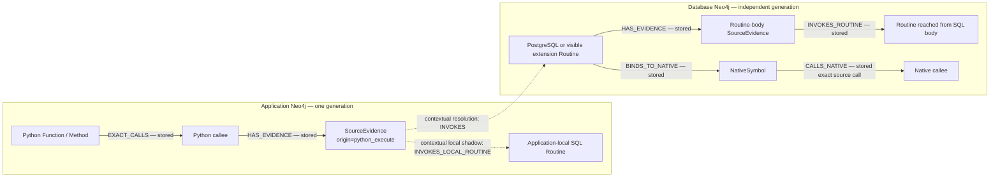

# CodeKG model overview

CodeKG is a static, generation-pinned source model with a request-time federation layer. It can connect facts from different source languages when the extractors can produce a concrete call/reference and the selected context can resolve it. It is **not** a general multilingual runtime call graph.

## Two separately served graphs

The current demo uses two independently exported and served Neo4j Community graphs, one of each kind:

- **Application graph** — application/repository source, including Python `Function`/`Method` entities, call sites, and SQL source facts.
- **Database graph** — a PostgreSQL source snapshot plus only the explicitly selected extension snapshots/dependency view, with SQL `Routine` declarations and C `NativeSymbol` facts.

The registry can hold multiple version-scoped database graphs at once (and multiple application graphs); each graph has its own corpus generation, Neo4j instance/data volume, endpoint and `CodeKGGeneration` marker. A `GraphContext` selects one application/database pair and names the application database, visible extension snapshot aliases, and SQL `search_path`; these are request-time selection rules, not graph-wide links. There are no stored Neo4j edges crossing between graph databases. Federation results identify both graph generations and the context ID; there is no separate context-revision field. The process pins the registry and verifies each backend's graph/generation marker before federation work. See [independent graph operations](independent-graph-operations.md) and the [validated federation demo](federated-kg-demo.md).

## Language switches are composed from evidence

A representative path is:

1. Python source contains a statically recognized function call, represented by an application-graph `EXACT_CALLS` edge.
2. A Python DB-API `execute` argument that is statically available as literal/constant SQL produces a `SourceEvidence` occurrence (origin `python_execute`). Statically extracted calls in SQL source use origin `sql_source`.
3. The selected context resolves its SQL name in order: application-local routine first; otherwise PostgreSQL plus the context's visible extensions under schema/search-path rules. This binding is virtual and computed at request time.
4. If the selected target is a SQL-language or analyzable PL/pgSQL routine, its extracted body references can resolve onward to another `Routine` in the database graph. For a C-language routine, `BINDS_TO_NATIVE` can connect the database `Routine` to a matching C `NativeSymbol`; a static native call may then continue along `CALLS_NATIVE`.

The app/database boundary is therefore a *composed result*, not a persisted edge. Dashed arrows below denote request-time composition; solid arrows denote stored relationships. A `SourceEvidence` occurrence is persisted in its owning graph, but its contextual binding is not.

The dashed arrows are result segments only. `INVOKES` means a request-time intent-to-routine binding in the database graph; `INVOKES_LOCAL_ROUTINE` means the same kind of binding to an application-local routine. Neither is a Neo4j relationship. Stored `INVOKES_ROUTINE` edges are different: they originate from `SourceEvidence` within their owning corpus/graph (including application-local SQL), not across graph databases, and represent extracted invocation evidence/resolution.

## What this model promises

- Source-oriented facts, locations, signatures/arity where available, provenance, generation IDs, and explicit resolution status.
- Context-aware selection of the database version, visible extensions, application-local shadowing, and schema search path.
- Bounded, read-only forward and reverse investigations that return exact paths separately from ambiguous, conditional, dynamic, or otherwise unresolved evidence.
- Independent application and database refreshes. Changing only a bridge context does not combine, rewrite, or re-import the graph generations.

## What it does not promise

- Runtime execution, actual installed extension compatibility, PostgreSQL ABI correctness, or that a conditional branch is taken.
- Arbitrary language-to-language call inference. The current cross-boundary evidence producers are specific extractors for Python SQL, SQL/PL bodies, selected Markdown evidence, PostgreSQL routine definitions/catalog data, and C source facts.
- Exact overload dispatch by SQL argument types: the current Python-to-routine evidence generally has arity but no argument types. A unique, compatible-arity, unguarded candidate can be reported as `exact`; that label is not a type-resolution proof.
- A complete execution graph across callbacks, dynamic names, repeated app/database boundary crossings, generated templates, or all preprocess/build configurations.

For source-level facts and constraints see the [detailed model specification](kg-model-detailed-spec.md). The existing [legacy corpus query model](../src/codekg/queries/corpus.py) describes stored intra-corpus relationships, not the virtual federation arrows above.
