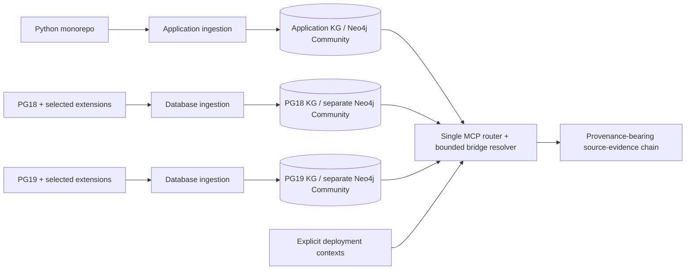

# Version-scoped knowledge graphs and on-demand MCP bridging

Status: Astra HIGH-validated design; the initial federation, independent lifecycle,
and scratch-validation optimization are implemented. See
[operator instructions](independent-graph-operations.md) for the shipped workflow
and the [live validation report](federated-kg-demo.md) for measured results and limits.
The full acceleration roadmap below is not all implemented.
Baseline studied: `ec76fb5`, including the PostgreSQL corpus feature at
`c55e3b2`, SQL/MCP query changes at `5680661`, and the rebuild changes.

## 1. Recommendation

Separate the frequently changing application from comparatively stable database
source contexts. Keep intra-KG relationships indexed, but resolve the
application-to-database boundary only when an investigation requests it.

- **Application KG:** one selected Python monorepo revision, its local SQL,
  Python call graph, Markdown, and extracted database-call evidence.
- **Database KG:** one selected PostgreSQL revision plus a declared set of
  extension revisions and their SQL/C facts. Resolve extension-to-PG and
  routine-to-native relationships at ingestion time within this KG.
- **One MCP endpoint:** explicit routing to KGs and bounded, read-only composition
  of evidence paths across their boundary.

For one PG context this means **two KGs**. For PG18 and PG19 investigations it
means **three KGs: application + pg18/extensions + pg19/extensions**. The
application is not copied for every PostgreSQL version. If comparison of two
application revisions is needed, register a second application KG explicitly.

Each KG has its own Neo4j Community instance, one standard database, data volume,
staging artifacts, and generation lifecycle. This is not two databases in one
Community instance. Neo4j documents the one-standard-database Community limit
in its [database administration manual][neo4j-databases]. No Enterprise Fabric,
composite databases, or cross-database Cypher features are required. Keep the
repository's Neo4j 5.26 deployment initially; validate all import/query behavior
on that image rather than relying on newer manual features.



**Priority:** independent refreshes, eliminate repeated application extraction,
then reuse extraction and parallelize measured bottlenecks. Splitting alone
does not make a first-time parse of all sources intrinsically faster.

## 2. What the latest implementation actually does

| Finding | Repository evidence | Consequence |
| --- | --- | --- |
| Rebuild duplicates the application and every extension for each PG context | Nested PG/extension/application loops in `rebuild-kg.sh` | Identical sources are extracted/projected again under different aliases. |
| Corpus extraction is serial | `export_corpus()` and `extract_snapshot_facts()` in `corpus_export.py` / `corpus_registry.py` | Increasing `--workers` only parallelizes ordinary projection. |
| Source revision incorporates dependencies | `snapshot_identity()` in `corpus_registry.py` includes aliases and dependency revisions in its fingerprint | Changing PG dependencies changes an app/extension identity even if source bytes are unchanged. There is no independent extraction-cache key. |
| One source read is not one parse | `stage_corpus_source_file()` calls ordinary Python/SQL parsing; `extract_snapshot_facts()` then calls supplemental parsers | Python is AST-parsed for ordinary IR and SQL evidence separately; SQL has ordinary, routine, and evidence passes. |
| Corpus publication rewrites and revalidates composed output | `_compose_graph()`, `_merge_csv_group()`, `_validate_composed_graph()`, `_merge_search_stages()` | Additional CSV/SQLite I/O follows per-snapshot staging and validation. |
| Source hashing makes separate consistency passes | Initial `_corpus_identities()`, per-snapshot identity check, and pre-publication identity check | Significant possible read amplification, but checks protect publication from concurrent source changes. |
| Exclusions are not one all-language policy | `selected_paths()` vs ordinary `SKIP_DIRS`; latest rebuild exclusions live under SQL configuration | SQL-only exclusions do not exclude Python/C/Markdown under the same generated/vendor tree; corpus traversal does not have all ordinary skip directories. |
| Query routing is single-backend | `get_client()` singleton; MCP wrappers mostly rely on query defaults | Backend injection must be explicit. Most query functions already accept `client`; code search also accepts `zvec_path`. |
| Existing combined trace is not a full Python call-chain engine | `_PATH_TYPES` in `queries/corpus.py` excludes ordinary Python call relationships | Federation must combine the existing Python traversal with evidence ownership and native traversal; cannot merely wrap the current corpus shortest-path tool. |

Existing disk-backed streaming, selective lookup indexes, conservative overload
resolution, source ownership, CSV bounds, and endpoint checks are assets to retain.
Do not replace them with corpus-wide in-memory maps.

The committed implementation spec records a six-context PG/extension export of
1,655,127 nodes / 3,318,772 relationships in 816.389 seconds while tests also ran.
It does **not** include the real huge application monorepo and is not a clean
end-to-end build baseline. No production speedup or dominant bottleneck can be
deduced from that number. The real monorepo baseline must be measured first.

`docs/rebuilding-kg.md` also refers to fast/full rebuild scripts and operator
documents absent from this checkout. Use actual `rebuild-kg.sh` / `run-compose.sh`
as the planning baseline, not those missing commands.

## 3. Graph scope, identities, and compatibility contexts

### 3.1 Separate source extraction from contextual resolution

Introduce four distinct identities; do not weaken provenance to achieve reuse:

1. **Extraction artifact ID:** selected-source content digest, language selection,
   file-relative identity where needed, parser/extractor versions, semantic
   extraction options, and coverage policy. No PG dependency revision or display
   alias. Cache root/repository-dependent naming inputs, or defer those names to
   projection; do not reuse root-dependent IR blindly.
2. **Resolution context ID:** extraction artifact IDs, explicit dependency
   revisions/visibility, schema/search-path policy, extension selection, and
   resolver version. Extension facts can be extracted once and resolved for
   PG18 and PG19 independently. Conditional C facts remain conditional.
3. **KG generation ID:** exact source/resolution identities, schema/projection
   version and graph/search/evidence/catalog checksums. The serving graph is an
   immutable indexed generation, not a mutable meaning of a version label.
4. **Bridge context ID:** application generation, database generation, selected
   application database/deployment target, visible extension set, schema/search
   path, and bridge resolver version. Changing a DB target invalidates bridge
   results without invalidating the application extraction.

An entity reference is an opaque tuple `{graph_id, generation_id, local_key}`.
Preserve local graph keys where possible, but never infer a backend from a key
prefix or globally identify an entity by qualified name. A logical comparison
identity is separate from its generation-specific entity reference.

### 3.2 A database KG is a compatibility context, not just a major version

`pg18` can identify one chosen PG commit with pg_cron/PostGIS commits. A second
extension release set or different PG18 minor/security revision can need another
KG, e.g. `pg18-release-b`. One logical repository revision per KG; do not put
two alternative PG commits or extension revisions in one resolution view.
Cross-extension dependencies are explicit; never resolve against every indexed
extension simply because it is registered in MCP.

The bridge's selected extension view must be compatible with the database KG's
materialized resolution context, including its dependency closure. A filter
cannot silently change the meaning of existing native/routine edges. If changing
extension visibility changes those edges, create a new DB resolution generation
using cached extraction; do not treat it as a bridge-only configuration edit.

The declared context is source-analysis configuration, not evidence that these
extensions are actually installed on a live database. If the selected sources
contain competing install/upgrade declarations, preserve existing ambiguity;
do not silently assert a runtime catalog from all SQL files.

### 3.3 Graph registry and target contexts

Add a strict registry separate from the current strict corpus TOML. Keep existing
single-corpus manifests readable; use new, versioned registry/build contracts.
Below is proposed syntax, **not an existing runnable configuration**:

```toml
schema_version = 1
default_application_graph = "app-main"

[[graphs]]
id = "app-main"
kind = "application"
generation_manifest = "artifacts/app/g42/manifest.json"
endpoint_env = "CODEKG_APP_NEO4J_URI"
credential_env_prefix = "CODEKG_APP_NEO4J"

[[graphs]]
id = "db-pg18"
kind = "database"
generation_manifest = "artifacts/pg18/g7/manifest.json"
endpoint_env = "CODEKG_PG18_NEO4J_URI"
credential_env_prefix = "CODEKG_PG18_NEO4J"

[[graphs]]
id = "db-pg19"
kind = "database"
generation_manifest = "artifacts/pg19/g3/manifest.json"
endpoint_env = "CODEKG_PG19_NEO4J_URI"
credential_env_prefix = "CODEKG_PG19_NEO4J"

[[contexts]]
id = "app-main-on-pg18"
application_graph = "app-main"
database_graph = "db-pg18"
application_database = "primary"
visible_extensions = ["pg_cron", "postgis"]
search_path = ["public", "pg_catalog"]
```

Credentials stay in the process environment or existing secret mechanism, never
in manifests/TOML. Validate graph roles, identities, extension availability,
capabilities, paths, and context references before activation. A symbolic context
resolves to an exact immutable generation pair at request start.

Multiple application DB connections require an explicit target or a represented
callsite mapping. If the extractor cannot prove which DB receives a query,
return `target_unknown` or `context_required`; a caller-selected target is an
analysis assumption reported in provenance, not an inferred runtime fact.

## 4. Ingestion boundaries

### 4.1 Application KG

Retain normal Python IR, module/callsite ownership, local SQL objects and
relationships, and Markdown enrichment. Add durable boundary evidence through
the scalable ordinary exporter as well as the corpus exporter; the present fast
ordinary path does not automatically acquire supplemental `parse_python_sql`
facts. Do not achieve a fast build by silently losing that evidence.

Store each database intent with owner, relative file/range, origin, raw/hash
evidence, SQL schema/name, arity/signature clues, dynamic/guard state and analysis
coverage. Retain local routine declarations and their ordinary/supplemental
identity mapping for shadowing and app-owned stored-function bodies.

Index forward owner-to-intent and reverse normalized schema/name-to-intent
lookups. An unqualified intent needs a name lookup as well as qualified lookup;
unknown/dynamic names belong to explicit coverage counts, not an exact index.
This enables bounded incoming-impact investigations without scanning the entire
monorepo. Index postings can be large; paginate them and label partial coverage.

Migration schema gap: current Neo4j `SourceEvidence` projection does not retain
schema, call arity or text/hash fields, and `Routine` projection omits default/
variadic argument counts (`_CORPUS_NODE_COLUMNS` in `corpus_export.py`). Raw
SQLite facts carry richer metadata. The new generation-bound evidence/routine
catalogs must preserve it (or expand versioned node contracts); existing Neo4j
node properties alone are not a sufficient lazy-bridge contract.

Resolve local relationships at ingestion. Preserve unresolved external SQL names
as **external intents**, rather than treating absence of a PG KG at build time
as a parse failure. Keep dynamic/ambiguous/conditional states distinct. Build
application-local routine bindings from its own facts plus the selected DB
context on demand; do not assume every extension caller is a Python execute.

### 4.2 Database KG

Index PG native C/header/catalog facts and extension C/SQL/control/templates.
Continue staging ownership and exact/candidate diagnostics. Eagerly resolve
routine-to-native, extension-to-PG, and explicit extension-to-extension links
inside the selected context. This work is reused by many application queries.

Publish an indexed routine/native identity catalog with exact source references,
signatures/arity/defaults/variadic metadata, declaration/condition state, local
keys, equivalence/ambiguity groups, and a generation checksum. This is a sidecar
index of existing facts, not a third KG or a complete materialized cross-KG join.

Do not require a zvec Python-callable stage on native-only KGs to manufacture
search support: current zvec indexes Python callables, not native facts. Expose
native/routine lookup capabilities separately; optional lexical native search
is a later independently benchmarked enhancement.

## 5. Single MCP: routing and request-time composition

### 5.1 Backend isolation

Use an immutable `GraphRegistry` and request-scoped `GraphHandle` that carries
the correct client, graph generation, lexical/evidence catalogs and capabilities.
Keep driver pools per configured endpoint/generation, and close retired pools
only after active requests finish. Never mutate process-wide `NEO4J_URI`, the
default zvec path, or singleton state to switch a request's graph.

Existing Python tools default only to the configured application graph. Corpus
tools accept an explicit graph selector; require one when multiple eligible DB
KGs exist. Missing/unavailable/wrong-capability graphs return typed errors, not
fallback results from another graph. Responses and cursors include graph and
generation identity. Keep compact text previews and canonical structured output.

### 5.2 Proposed tool surface

Register a fixed tool set; do not create 19 tools per backend.

| Tool/change | Purpose |
| --- | --- |
| `list_knowledge_graphs` | Discover graph kind, indexed sources/revisions, generation, readiness, capabilities and registered contexts. |
| Existing Python/SQL/corpus tools: optional or required `graph_id` | Query the selected KG without changing ordinary semantics. |
| `list_database_intents` | Page an owner's extracted executable/documentation/dynamic SQL boundary evidence in the app KG. |
| `resolve_database_intent` | Resolve one exact evidence reference under one explicit context; return candidates, source metadata and assumptions. |
| `trace_application_database_path` | Compose an app entry/owner, boundary evidence, resolved routine, extension C and PG target into bounded paths. |
| `find_application_database_usages` | Reverse lookup callers of a selected routine/native API under one context with indexed intent postings. |
| `compare_knowledge_graphs` | Cross-KG PG/extension comparison by logical repository and streaming identity groups, not local entity keys. |

Single-KG `trace_call_path`, `trace_corpus_path`, and comparisons remain available.
Cross-KG comparison must replace the current assumption that both aliases exist
in one client's database. Stream sorted, paged groups from each immutable
catalog and reuse established logical-scope/signature matching; bound both work
and memory. Multiple overloads and incomplete coverage stay ambiguous.

### 5.3 Forward trace algorithm

For `app.entry -> cron.schedule -> cron_schedule -> PG API`:

1. Pin the registry epoch, application generation, DB generation and context.
   Validate exact entity references and endpoint generation metadata.
2. Traverse existing exact Python call relationships to reachable evidence
   owners within an explicit work/depth budget. A direct evidence reference can
   bypass discovery. Include app-local SQL/routine paths when represented.
3. Load bounded intents and merge application-local declarations with the
   selected database routine catalog using the existing resolution policy:
   own/local precedence, ordered search path, quoted identifiers, arity/defaults,
   overload ambiguity and explicit dependency visibility. Unknown types are not
   exact merely because an overload has a similar signature string.
4. Create virtual bridge edges in the response; never persist them into either
   Neo4j KG. Distinguish executable `INVOKES` from `DOCUMENTS`. Guarded,
   ambiguous and dynamic links are reported separately, not exact-path edges.
5. Traverse database-local exact routine/native relationships to the supplied
   target, or return bounded continuation points if no native target is supplied.
6. Return joined segments with graph IDs, revisions, source ranges, edge kinds,
   resolution reasons, context assumptions and coverage. Recheck generation
   validity; never return a mixed-generation path.

Database local paths are precomputed **edges**, not all transitive chains.
Federated tracing does not enumerate the Cartesian product of every local path.
Return deterministically ordered admissible paths, not a promise of global
shortest-path completeness. The first iteration crosses the app/DB boundary
once; repeated callbacks/multiple boundary crossings are explicitly unsupported.

### 5.4 Reverse impact and budgets

For a PG API investigation, walk bounded exact incoming native/routine edges,
then query indexed application intent postings for the reached exported routine
names. Re-run forward contextual resolution of each intent: a name-only posting
is a candidate, not proof of use. Own/local shadowing must filter false matches.
Page large result sets and include coverage for unresolved/dynamic SQL.

Initial, tunable server caps: eight **total reported chain edges**, five paths,
32 returned resolution candidates plus a sentinel to detect overflow, 1,000
visited traversal states, 100 boundary intents/postings per page, ten seconds
total wall time and a 64 KiB structured response budget. Ownership and virtual
edges count toward the chain limit. Backend transactions receive the remaining
deadline; output row limits alone do not bound graph exploration. Overflow,
deadline, fan-out and serialization caps return `truncated=true`, a reason and
generation-bound continuation where supported. Candidate overflow must never
be misrepresented as unique exact resolution.

Cursor state pins query/context/generation and is bounded or leased with expiry;
if its generation is retired, return `generation_expired`, not data from the new
generation. No global mutable 'currently selected PG version' across MCP clients.

Federated traversal uses explicitly bounded, indexed frontier expansions with
capped per-step adjacency retrieval and a shared remaining-work/deadline budget.
Do not invoke unrestricted local `allShortestPaths` and subsequently count the
returned states. High-fanout tests must demonstrate early truncation/cancellation;
the existing corpus trace implementation is not itself this work-bounded engine.

Optional bounded LRU caches store resolution results, not whole transitive
closures. Keys include the complete bridge context ID, evidence reference and
options; path keys include both endpoints and all budgets. Cache misses must
not rebuild either KG. Default persistent cross-KG caching is deferred.

## 6. Performance work, in order of value

| Priority | Change | What it removes / constrains |
| --- | --- | --- |
| P0 | Phase/per-snapshot measurements and a clean baseline | Prevents optimizing the wrong stage. |
| P1 | Application and DB builds/publishing independent; no app-per-PG aliases | Removes unchanged PG work from application refresh and repeated monorepo extraction. |
| P1 | Durable boundary intents in ordinary bulk export | Preserves cross-language usefulness without combined ingestion. |
| P1 | Content-addressed extraction cache, separate resolution identity | Reuses extension extraction across PG contexts; PG changes re-resolve rather than reparse unchanged extension source. |
| P2 | Shared parsed Python/SQL source adapters | Avoids independent AST/parser construction while keeping distinct semantic visitors, diagnostics and offset behavior. |
| P2 | Byte-budgeted extraction worker spools and batch SQLite insertion | Parallelizes currently serial parsing without shared writable registries. |
| P2 | Reuse canonical CSV shards where safe | Avoids wholesale rewrites after each per-snapshot export. |
| P3 | Incremental dirty-file extraction and affected-scope resolution | Reduces warm update work; correctness requires conservative invalidation. |
| P3 | Explicit source scope and compact native/evidence indexing | Avoids processing excluded/generated facts and unnecessary indexes. |

### 6.1 Extraction cache and invalidation

Start with immutable per-source-snapshot extraction artifacts. Rebind alias/key
namespaces during contextual projection; raw parser facts and source ordinals
must not embed PG-dependent keys. Later add per-file reuse with explicit file
deletion/rename handling. An unchanged importable Python symbol can still affect
other files' resolution when an import/export changes; invalidate the affected
repository/context conservatively until a correct dependency invalidator exists.
PG API changes may invalidate the whole DB context's resolution, but not raw
extraction of unchanged extension files.

Distinguish **bridge-only context edits** (selecting an already built compatible
DB KG or changing application target/search-path assumptions) from **database
resolution-context edits** (dependencies/visibility/resolver policy that affect
materialized local edges). The latter reuse unchanged extraction, but require
resolution, projection, validation and a new offline-imported DB generation.

Validate content/config/parser identity before a cache hit. Cache entries are
immutable/checksummed and written atomically. Never use commit SHA or mtime alone
for a dirty worktree. Preserve the existing source-change publication checks;
shared per-file digests and an extraction-time streaming digest may reduce
redundant passes only with equivalent coverage of additions, removals, unreadable
files and concurrent mutation. Hashing/validation still cost time on warm builds.

### 6.2 Parallel extraction

Workers emit private, bounded ordinary/native SQLite spools; the coordinator
merges deterministically by relative path and fact ordinal, builds shared indexes,
then resolves. No concurrent writes into the existing corpus SQLite connection.
Use one global CPU/memory/temporary-disk budget across KGs and phases, rather
than multiplying `--workers` by graph count. Native/ordinary adapters share the
same bounded source read and parsed tree where possible.

Bound outstanding input bytes, batch files, serialized fact bytes and active
worker count. A source-size cap is not an AST/facts memory bound; enforce/test
worker resource limits or rejection diagnostics and measure **aggregate** parent
plus workers/container peaks. Ensure process interruption and failed workers
leave no published incomplete artifact. Start with worker counts 1/2/4 and stop
adding workers once SQLite, disk or memory is the bottleneck.

### 6.3 Projection, composition and source policies

The importer already accepts file groups. Neo4j's [full-import documentation][neo4j-import]
describes multiple files as one logical input. Emit canonical schema headers and
headerless data shards, and validate ID uniqueness/endpoints with bounded
disk-backed joins across them. Normalize incompatible layouts explicitly (e.g.
ordinary SQL/Python versus supplemental relationships), including field bounds.
Do not skip validation or pass repeated headers as data. Benchmark shard-native
imports on pinned Neo4j 5.26 before replacing composition.

One all-language selection policy should govern traversal, hashing, both parser
adapters, cache identity, diagnostics and exports. Prefer pruning excluded
directories before walking. Exclude generated/scratch/vendor material only by
explicit configuration and report the policy/coverage; blanket exclusions can
hide application-owned vendored integrations. Keep PostgreSQL catalog/extension
templates and needed headers selected. Limit or hash bulky evidence/body payloads
only under a versioned coverage contract that preserves definition retrieval.

## 7. Independent publication and Community deployment

1. Build the chosen KG generation in new staging and new Neo4j data volumes;
   never run `down --volumes` on the active whole stack as a refresh mechanism.
2. Import offline into that KG's isolated candidate instance, bootstrap schema,
   record/verify generation metadata and validate its graph, catalogs and any
   lexical index as one coherent artifact.
3. Publish a new registry epoch mapping only the chosen graph to its candidate
   endpoint/artifacts after readiness checks. New requests use it; in-flight
   requests keep old generation-specific handles/endpoints. Activation can use
   candidate containers briefly in parallel; never overwrite an endpoint's data
   behind an old pinned handle.
4. Failed builds leave every active KG and registry untouched. Rollback switches
   the mapping to a retained generation. GC honors active registry references,
   in-flight requests and cursor leases; invalidate ephemeral result caches on
   retirement.

Independent graph publication does not require one distributed transaction.
The coordinator pins one explicit pair for a trace; all responding backends must
serve that pair. An unavailable selected DB returns `backend_unavailable` while
Python-only tools continue to work. Do not auto-substitute PG19 for PG18.

Separate Community instances add fixed heap/page-cache and container overhead.
Budget memory per KG and cap the sum; build candidates sequentially on constrained
hosts. Keep non-selected comparison versions offline by operator choice if needed.
MCP discovery reports `offline` and comparison returns an explicit unavailable
status; it does not silently start containers during a read-only tool call.
A later explicit operator lifecycle command can activate a retained KG. For the
first milestone, cross-KG online comparisons require both selected KGs ready.

## 8. Delivery plan and verification gates

These are roadmap lanes; implementation and live verification are tracked separately.
Terra owns integration/checks; bounded Luna write scopes and final Sol review
follow `AGENTS.md`. At most one implementation lane at a time where files overlap.

| Phase | Deliverables and main write scope | Exit gate |
| --- | --- | --- |
| 0: Profile and fixtures | Export/ingestion/import/search telemetry, benchmark fixture/config and clean real-source run | Per-KG/per-phase timings, selected bytes/counts, aggregate peak memory, disk I/O/temp bytes; fresh/warm caches clearly separated. |
| 1: Routing and independent lifecycle | New registry/graph-context module; `neo4j_client.py`, MCP wrappers, Compose/build orchestration | Two isolated Community databases accessed through one MCP; PG backend down does not break Python queries; failed rebuild preserves active graphs. |
| 2: Boundary ingestion and catalogs | `native_evidence.py`, ordinary/corpus bulk adapters, native IR/registry, schema; versioned sidecars | App indexed once without PG source; durable local ownership/intents and database catalogs are exact-generation coherent. |
| 3: Lazy bridges and traces | New bridge resolver/query modules; MCP tools; forward/reverse indices and caps | Literal/runbook -> pg_cron SQL -> extension C -> selected PG API; no writes/rebuilds on MCP requests; negative/ambiguity tests pass. |
| 4: Multiple version KGs | Cross-KG compare service, context selection, cursor/generation handling | Same app generation traces against two DB generations; PG18/PG19 never leak into each other's results; comparison does not merge stores. |
| 5: Ingestion acceleration | Extraction-cache keys/artifacts, shared parsers, workers, shard-native composition | Warm reuse and measured cold improvements with semantic parity at workers 1/2/4; no regression in memory/coverage/endpoint integrity. |
| 6: Operator rollout | New non-destructive commands, explicit migration guide, obsolete rebuild docs corrected | Candidate/rollback exercise and real monorepo benchmark; operator selects active generations, no destructive migration is implied. |

Routing alone in phase 1 is not feature-complete: declare split build usable only
after phase 3 preserves the cross-language investigation workflow. Implement
the extraction-ID seam during phase 2 so phase 5 does not require another identity
redesign. Compatibility-breaking new staging contracts are allowed, but document
the one-time migration; do not silently reinterpret existing manifests/keys.

### 8.1 Correctness suite

- One MCP, app + PG18 + PG19 on separate Community instances; exact entity and
  cursor routing, concurrent clients selecting different contexts, no global
  mutable selector, no per-graph multiplication of tool schemas.
- Full Python entry -> execute evidence -> routine -> extension native -> PG
  chain, plus app-owned SQL routine -> external routine and reverse PG impact.
- Existing exact/candidate/conditional/native file-static resolution, overloads,
  arity/default/variadic rules, quoted/dotted identifiers, ordered search path,
  own/local shadowing, explicit extension visibility and template diagnostics.
- Unknown application database target, selected-target assumptions, dynamic SQL,
  unsupported languages, ambiguous install/upgrade definitions, documentation
  evidence never asserted as executable calls.
- Update during a trace/cursor, failed backend, cancellation/deadline, high fanout,
  candidate overflow, response byte cap and total chain-depth accounting.
- Cache hit/miss/corruption, rename/delete, dirty worktrees, semantic config/parser
  changes, dependency-only changes, deterministic spools and bounded resources.
- Bridge-only context edits perform no build work; DB resolution-context edits
  produce a new correctly resolved/imported generation while reusing unchanged
  extraction. Extension-view changes cannot invalidate native edges silently.
- Fresh import/bootstrap on Neo4j 5.26 Community; per-KG uniqueness/endpoints,
  large CSV fields, indexed intent/catalog lookups, graph/search key parity,
  legacy single-KG MCP/regression behavior and existing compact transport gates.

### 8.2 Performance experiments and acceptance

Measure the same sources, parser/index versions and coverage policy on the same
host. Run without the test suite competing for resources. Repeat clean runs
enough to expose variance (at least three for the selected comparison); report
wall time, summed CPU time, bytes read/written, temporary disk and aggregate
memory, not just exporter parent RSS or node counts. Compare:

1. Current combined build with app repeated per PG context.
2. One app + one database KG, both cold; then two DB version KGs, all cold.
3. No source changes, application-only edit, extension-only edit, PG-only edit,
   and context/search-path-only change, with extraction cache cold/warm labeled.
4. Request-time forward/reverse paths, selective/high-fanout cases, both warm and
   uncached; Python-only query latency while DB builds occur.

Acceptance includes directly testable work elimination:

| Scenario | Required behavior |
| --- | --- |
| App-only refresh | Zero PG/extension parse, projection, import or DB-search rebuild work. App evidence is retained. |
| Add PG19 investigation | Zero app extraction/projection/import work; only new DB context and registration. |
| Same extension source for PG18/PG19 | One raw extraction artifact per semantic extraction config, independent contextual resolution/projection. |
| Bridge-only context change | Zero source ingestion/import when referencing existing compatible KG generations; only contextual lookup/cache invalidation. |
| DB resolution-context change | Reuse unchanged extraction; re-resolve/reproject/validate/reimport a new DB generation if local edge semantics change. |
| MCP trace/compare | Zero graph mutation, source reparse or container/build activation; bounded backend/candidate/traversal work. |
| Failed generation | Previously serving app/DB pair remains usable and coherent. |

Initial latency goals, to confirm after phase 0: ordinary app refresh no more
than 20% over an equivalent app-only build including new evidence extraction;
selective cross-KG trace p95 <= 2 seconds, reverse-impact page p95 <= 5 seconds,
hard per-request cap 10 seconds. These are proposed acceptance targets, not
measured results. The equivalent baseline must include comparable evidence and
coverage. Publish real cold-build deltas before claiming a factor-of-N speedup;
if parsing or full application projection dominates, split topology cannot
remove that cost and phase 5 becomes the next priority.

## 9. Decisions and limits

- Recommend the **two-KG minimum, version-scoped family** over one all-version
  combined store. Keep the existing combined workflow available during migration.
- Materialize facts and local edges at ingestion; materialize only requested
  cross-KG source paths at query time. Do not move all C/SQL resolution to MCP.
- Separate Neo4j Community instances are mandatory for independently served
  databases under the current edition. No database product/license migration.
- No live database crawling, runtime SQL recovery, native builds, ABI/security
  verdicts, automatic version switching or complete runtime-call-chain claims.
- Exact source links are not execution proofs. An incomplete/no path result
  does not prove absence of a runtime dependency.

## 10. Astra HIGH validation

Independent `gpt-6-astra` subagent at **HIGH** reasoning performed read-only
source inspection and `FINAL_REVIEW`. Outcome: **approve with amendments**.

All three findings were incorporated and checked against the source:

1. **Medium:** the context-only zero-ingestion guarantee was too broad. Sections
   3/6/8 now distinguish bridge-only edits from DB resolution-context changes,
   require compatible extension views, and specify separate acceptance tests.
2. **Low:** visited-state caps alone cannot bound backend path expansion. Section
   5 now requires bounded indexed frontier queries and early truncation, not a
   wrapper around unrestricted shortest-path enumeration.
3. **Documentation:** existing graph projections omit metadata needed to redo SQL
   resolution correctly. Section 4 names the schema gap and requires richer
   generation-bound catalogs or versioned projection fields.

This validates the proposal, not an implemented speedup. Document checks cover
whitespace, fenced blocks, TOML example syntax/references and principal source
paths. No graph rebuild, production mutation or implementation test suite was
performed for this design-only change.

[neo4j-databases]: https://neo4j.com/docs/operations-manual/current/database-administration/
[neo4j-import]: https://neo4j.com/docs/operations-manual/current/import/full-import/
